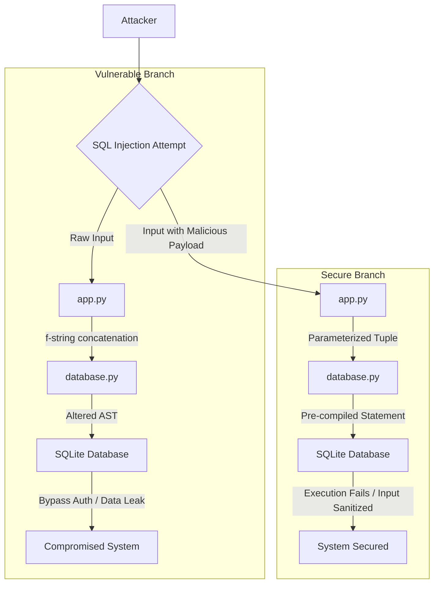
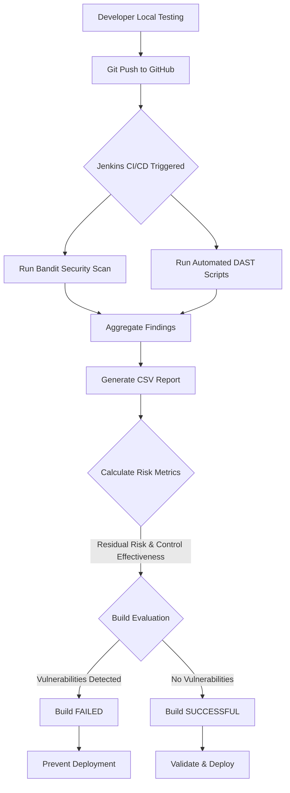

# Information Security and Risk Management (ISRM): Vulnerability Demonstration & Remediation Platform

## 1. Project Overview

The **ISRM Vulnerable Student Management System** is a research-grade, educational web application designed to demonstrate critical web security vulnerabilities and their industry-standard remediations. 

In the modern landscape of cybersecurity, theoretical knowledge is insufficient. This project solves the problem of abstract security education by providing a tangible, hands-on environment where developers and security researchers can actively exploit vulnerabilities—such as SQL Injection, Cross-Site Scripting (XSS), and Cross-Site Request Forgery (CSRF)—and subsequently analyze the patched, production-ready code. The high-level system idea is a dual-state architecture: a vulnerable baseline application and a fully secured iteration, allowing for direct comparative analysis of code patterns.

## 2. Core Features

The system operates as a functional Student Management System while serving as a security sandbox.

*   **Vulnerability Sandbox (`main` branch):**
    *   **Authentication Bypasses:** SQL Injection in login flows.
    *   **Data Exfiltration:** Broken Access Control exposing sensitive student data (SSN, Passwords).
    *   **Client-Side Attacks:** Stored and Reflected XSS in search and student records.
    *   **Session Exploitation:** Missing CSRF tokens allowing unauthorized state changes.
    *   **File System Access:** Unrestricted file uploads and Path Traversal vulnerabilities.
*   **Production-Ready Security (`fixed-version` branch):**
    *   **Robust Authentication:** Parameterized queries, rate-limiting against brute-force attacks.
    *   **Strict Access Control:** Role-Based Access Control (RBAC) isolating Admin, User, and Student privileges.
    *   **Input Sanitization:** Comprehensive validation and output encoding to neutralize XSS.
    *   **Secure File Handling:** Extension whitelisting, secure filename generation, and directory constraints.
    *   **Hardened Headers:** Implementation of CSP, X-Frame-Options, and X-Content-Type-Options.

## 3. System Architecture

The application is built on a monolithic Model-View-Controller (MVC) architecture, heavily optimized for comparative security research.

*   **Frontend (View):** Built with HTML5, CSS3 (incorporating modern glassmorphism UI), and Jinja2 templating. The frontend dynamically renders data but relies on the backend for security enforcement.
*   **Backend (Controller):** A Python Flask application (`app.py`) handling routing, session management, and business logic. It dictates the security posture (vulnerable vs. secure) based on the active branch.
*   **Database (Model):** A serverless SQLite database (`vulnerable_app.db`) managed via `database.py`. It stores user credentials, student records, and system logs.
*   **Testing Utilities:** Automated scripts (`test_vulnerabilities.py`, `generate_vulnerability_report.py`) that perform Dynamic Application Security Testing (DAST) against the running instance.

## 4. Security & Exploitation Pipeline

The following diagram illustrates the comparative data flow between an attacker attempting SQL Injection on the Vulnerable Branch versus the Secure Branch.



## 5. Technology Stack

*   **Python 3.x:** Core programming language.
*   **Flask:** Lightweight WSGI web application framework chosen for its transparency, making security vulnerabilities (and their fixes) easy to trace without abstraction magic.
*   **SQLite3:** File-based relational database. Chosen because it requires no external infrastructure, making the application highly portable for security testing.
*   **Werkzeug:** Comprehensive WSGI web application library (used for secure filename processing and password hashing).
*   **Jinja2:** Templating engine used for rendering dynamic HTML and demonstrating context-aware XSS vulnerabilities.

## 6. Branch Comparison

Understanding the branch structure is critical to the educational value of this repository.

| Feature | `main` Branch (Vulnerable) | `fixed-version` Branch (Secure) |
| :--- | :--- | :--- |
| **Purpose** | Demonstrates anti-patterns and vulnerabilities. | Demonstrates industry-standard security practices. |
| **Database Queries** | Raw string formatting (`f"SELECT..."`). | Parameterized tuples (`execute(query, (var,))`). |
| **Access Control** | UI-hidden links; no backend enforcement. | Strict server-side RBAC validation per endpoint. |
| **Session State** | Persistent, predictable, no CSRF validation. | Secure tokens, timeout enforcement, session regeneration. |
| **Error Handling** | Verbose; leaks stack traces and DB structures. | Generic user-facing errors; detailed internal logging. |

*Both branches exist simultaneously so developers can view the exact `diff` required to secure a vulnerable codebase.*

## 7. Setup Instructions

To run the project locally for security testing:

1.  **Clone the repository:**
    ```bash
    git clone <repository-url>
    cd ISRM_Proj
    ```
2.  **Select your target environment:**
    *   To test vulnerabilities: `git checkout main`
    *   To test secure implementations: `git checkout fixed-version`
3.  **Create a virtual environment:**
    ```bash
    python -m venv venv
    source venv/bin/activate  # On Windows: venv\Scripts\activate
    ```
4.  **Install dependencies:**
    ```bash
    pip install -r requirements.txt
    ```
5.  **Run the application:**
    ```bash
    python app.py
    ```
    *The application will be accessible at `http://127.0.0.1:5000`.*

## 8. Core Logic Explanation

### Explaining the Vulnerability Architecture
Instead of relying on third-party security flaws, the system's "vulnerable logic" is intentionally woven into the application layer:
*   **SQL Injection Mechanism:** In the `main` branch, the database connection accepts raw string inputs directly from the HTML forms. When an attacker inputs SQL operators, the Python interpreter blindly concatenates them, altering the logical structure of the query before it hits the SQLite engine.
*   **XSS & CSRF Systems:** The templating engine in the `main` branch renders user input with `|safe` tags, telling the browser to execute any injected JavaScript. Furthermore, state-changing requests (like adding a student) require no unique tokens, allowing attackers to forge requests using pre-authenticated session cookies.

### Explaining the Security System
*   **The Defense-in-Depth Approach:** The `fixed-version` branch implements a multi-layered defense. Rate-limiting logic tracks authentication attempts in memory via timestamp arrays, locking out brute-force attacks mathematically.
*   **Data Neutralization:** Database queries are decoupled from data payloads. The SQLite engine pre-compiles the SQL statement structure, and user inputs are strictly treated as literal string values, mathematically guaranteeing that injected SQL operators cannot alter the query's AST (Abstract Syntax Tree).

## 9. CI/CD Security Pipeline

The repository integrates a robust continuous security testing pipeline via Jenkins. This ensures that any code pushed to the repository is automatically scanned for vulnerabilities before being marked as a successful build.



### Pipeline Workflow Details:
1. **Testing**: Developers perform local testing of security implementations and patches.
2. **Git Push**: Commits are pushed to the remote GitHub repository.
3. **Jenkins Build Runs**: The push event automatically triggers the Jenkins CI/CD pipeline, initiating code security checks including **Bandit scanning** for Python vulnerabilities.
4. **Report Generation**: The pipeline aggregates the results from Bandit and other automated security testing scripts, compiling the findings into a detailed **CSV report format**.
5. **Risk Assessment**: Using the data aggregated in the CSV report, the system automatically calculates the **Residual Risk** and evaluates **Control Effectiveness** to provide actionable security metrics.
6. **Build Evaluation**: 
   - If the CSV report flags **Vulnerabilities** (e.g., on the `main` branch), the pipeline halts and marks the build as **FAILED**, preventing insecure code deployment.
   - If the CSV report indicates **No Vulnerabilities** (e.g., on the `fixed-version` branch), the pipeline validates the changes and marks the build as **SUCCESSFUL**.


## 10. Folder Structure

```text
ISRM_Proj/
├── app.py                         # Main application entry point & routing
├── database.py                    # Database initialization & interaction logic
├── config.py                      # Application configuration and environment variables
├── requirements.txt               # Python dependencies
├── test_vulnerabilities.py        # Automated DAST vulnerability testing script
├── generate_vulnerability_report.py # Generates JSON/HTML security reports
├── vulnerable_app.db              # SQLite database (generated on runtime)
├── static/                        # CSS, JS, and image assets
│   ├── css/
│   │   └── style.css              # Custom glassmorphism styling
├── templates/                     # Jinja2 HTML templates
│   ├── login_new.html             # Authentication interface
│   ├── dashboard_new.html         # Main application hub
│   └── ...                        # Other view templates
├── uploads/                       # Target directory for file upload vulnerabilities
└── ... (Markdown Documentation)   # SECURITY_FIXES, VULNERABILITIES, etc.
```
